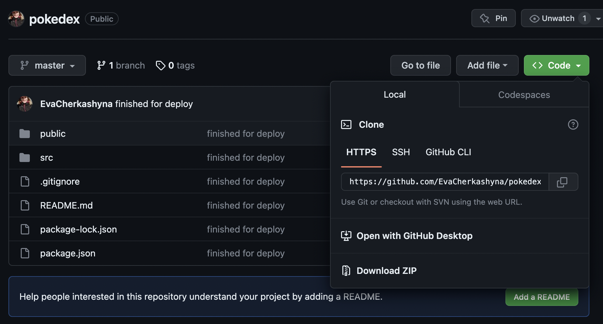

# Deploy: [Pokedex](https://pokedex-pink-two.vercel.app/)


# Get started
### In order to start, you need to do one of the following stepd:


## Step 1 (install code):
### Option 1:
Download the code in zip format. (Click on green "code" button and press "Download ZIP")
### Option 2:
Clone the project. Open commander at your laptop and write this command:
```sh
git clone https://github.com/EvaCherkashyna/pokedex.git
```

## Step 2 (install dev dependencies):

Open the folder "pokedex" in the code editor and open the terminal, make sure you are in the folder. After that write this command:

```sh
npm install
```

## Step 3 (run code at your localhost):

Write this command at the terminal:

```sh
npm start
```

### ⭕️ In case of problem

```sh
 npm audit fix --force
```

##### if it ⬆️ doesn't work try this ⬇️

```sh
npm config set legacy-peer-deps true
```
